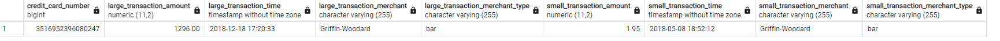
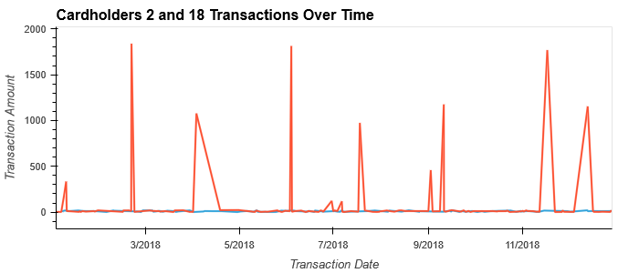

# Fintech Bootcamp - SQL Challenge

## Summary

This repository contains the files for the module 7 homework assignment: SQL challenge.

## File description

### Primary Code

The primary code and deliverables are located in this folder:

- entity_relationship_diagram.png (Entity relationship diagram of the tables in the database)
- schema.sql (Creates the tables in the database)
- queries.sql (Contains the queries used in this analysis)
- visual_data_analysis.ipynb (Contains the Jupyter notebook for the assignment)
- challenge.ipynb (Contains the Jupyter notebook for the challenge portion of the assignment)

### Data Files

All of the data files can be found in the Data folder, which includes csv and seed files for the information in the database.

### Images

All of the image files used in this markdown report can be found in the Images folder.

## Markdown Report for the CFO

### Part 1:

Based on the cardholder data, there is some evidence that certain cards may have been hacked.  There are 10 cards in the dataset with particularly high maximum transactions and standard deviations:

By themselves, high transaction values and standard deviations aren't necessarily indicative of fraud.  However, several suspicious transactions occurred between 7 and 9 AM, particularly to bars and restaurants:

Although some transactions are suspicious, it bears repeating that doesn't necessarily mean that they're fraudulent.  It's hard to determine from the data alone that certain transactions are fradulent, and customers whose transactions are suspicious should be contacted and asked about them.

There don't seem to be a higher number of fraudulent transactions made between 7 and 9 AM than there are at other times.  Large purchases are made throughout the day, and the best evidence for certain transactions being fraudlent is that some of them have been made at odd hours for certain types of merchants:

Intuitively, when looking for fraudulent behavior, one would expect a small purchase (to test the validity of the card) followed by an uncharacteristically large purchase.  If one expects the small and large purchase to be made at the same merchant, then there is only one such example in the dataset, but the small purchase predates the large one by seven months:

Alternatively, if one allows the small purchase to be made at any merchant, but still requires the small purchase to be made less than 7 days prior to the large purchase, then there are only 4 such examples in the dataset, but none of them seem particularly strange:

Similarly, it's not clear if any merchants are prone to being hacked through small transactions.  The merchants with the highest number of transactions that are less than $2 are as follows:

Intuitively, it's surprising to see bars and pubs (Wood-Raminez, Hood-Phillips, Jarvis-Turner, Atkinson Ltd, Greene-Wood) making this list, because it's hard to imagine a bar or pub regularly charging its customers less than $2 in a transaction.  However, that alone doesn't make the charges fraudulent, and it would be important to follow up with the individual customers to see if they made those purchases.

### Part 2:

The following is a line plot of Cardholder 2's transactions over time:

Although plot looks noisy, it's only noisy because of the scale along the y-axis.  All of the transactions are fairly small, and if there are any fraudlent transactions, then it's not obvious which ones they are.  Cardholder 2 would have to go through their transaction history and identify which ones (if any) are fraudulent.

By contrast, the following is a line plot of Cardholder 18's transactions over time:

This plot shows several anomalous transactions, most of which are over $1000.  Those large transactions may be instances of fraud, but one would have to check with Cardholder 18 to be sure.

When the plots are overlayed, it becomes easier to see how Cardholder 18's transaction history is different from Cardholder 2's transaction history:

Cardholder 18 has anomalously large purchases whereas Cardholder 2 does not.  Those purchases may be indicative of fraud, but it's not possible to know for sure without checking with the cardholder.  Intuitively, one would expect fraudulent charges to be large, because a thief would want to get as much value out of the stolen credit card information as possible.  However, not every instance of fraud is large, and not every instance of an anomalously large purchase is fraudulent.

For Cardholder 25, the following is a box plot of their transactions in the first six months of 2018:

There are several outliers in Cardholder 25's transaction history.  The number of outliers by month:

- January: 1
- February: 0
- March: 1
- April: 3
- May: 1
- June: 3

These are all anomalously large transactions and many of them were at restaurants.  Relative to Cardholder 25's normal purchases, the magnitude of the anomalous transactions makes it hard to appreciate the rest of the box plot.  Cardholder 25's concerns are warranted, and I would recommend that they review their transaction history.  If any of the large charges are fraudulent, I would recommend Cardholder 25 get a new credit card.